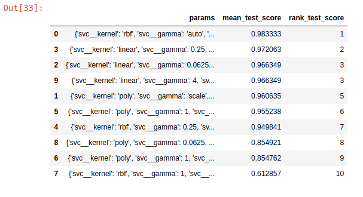
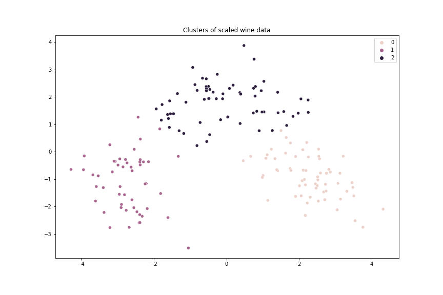
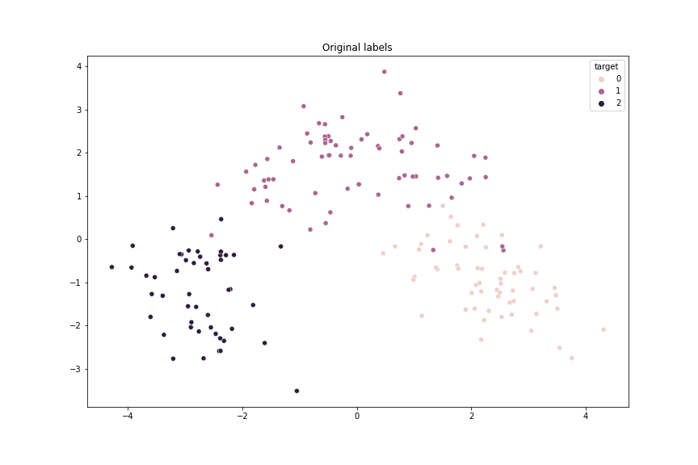

### Using Pipelines for supervised and unsupervised learning

In this project, I used pipelines to create a clustering model, as well as to create a classification model. I used 5-fold cross validation along with Randomized Grid Search, to efficiently search through the parameter space, and find the best performing classification model. 

**The result/conclusion is the following:**

The clusters created by the Kmeans algorithm:

The classes based on the original labels:

The result accuracy is 98.3 % for the classification model and 96.6 % for the clustering model. 
